# Yarn Spec
*Language version 2 | Last updated: 30th September 2021*

This document defines the Yarn Script version 2 language format, and contains guidance and rules for implementing programs to process Yarn 2 scripts.

## Introduction

Yarn is a language for representing branching and linear interactive fiction in games.
Yarn was created for the game Night in the Woods and was inspired by the Twine language.
Its focus is on flexibility and writer ease; the primary goal of the language is to have clear, minimal syntax and to remain as close to just writing dialogue text as possible.
For writers there should be minimal friction in authoring in Yarn and, for programmers, there should be minimal annoyance when interfacing with it.

During development of Night in the Woods, Yarn Spinner was created as an open source framework to better integrate Yarn with the Unity Game Engine--a side project and had no affiliation to Night in the Woods at the time.
But Yarn Spinner could read and understand Yarn files, and had several advantages over the Yarn interpreter in Night in the Woods, so the decision was made to use Yarn Spinner for the game.
This made Yarn Spinner the de facto Yarn interpreter and had the side effect of giving it control over the specification of the language.
Yarn essentially became and was henceforth defined by what Yarn Spinner could understand.

As Night in the Woods was developed additional features, and work was done on Yarn Spinner for the game, the set of features and syntax exploded and became difficult to understand or reimplement.
Post-Night in the Woods, Yarn Spinner continued as an independent project. 
Yarn Spinner version 0.9 was mostly a polished form of the framework as was used in Night in the Woods, but 1.0 came with improved syntax and was the first significant release that wasn't tied to Night in the Woods.

Neither Yarn Spinner 0.9 or 1.0 however came with complete specifications of the Yarn language and had a great deal of legacy elements.
A concerted effort was made to clean up the Yarn language for Yarn Spinner 2.0 into something hopefully more understandable but also more flexible.
A component of this is the creation of this specification guide, so implementations of alternative interpreters or other Yarn- or Yarn Spinner-related tools can have a clear source of truth (that isn't "just copy what Yarn Spinner does").
We hope this will empower others to make their mark on the broader Yarn Spinner ecosystem, by supporting the creation of new tools or bridging frameworks to bring Yarn Spinner to a broader range of game engines and workflows.

Despite this being the first time a Yarn language specification has existed, it is version 2 of the Yarn language.
This is to avoid confusion that would arise should the Yarn language specification and the Yarn Spinner framework be versioned separately.

### Coverage

This document covers the elements of a Yarn script that are required to be considered valid, as well as the rules necessary for an implementing program to conform to this specification.

An *implementing program* is a program that accepts Yarn files as inputs and understands them based on the rules in this document.
This document does not cover how a Yarn file is to be transformed or handled internally by an implementing program.

This document does note when behaviours are *unspecified*.
The implementing program may choose how to handle any unspecified behaviour, often unspecified behaviours have no good solution and should result in an error.
An example of unspecified behaviour are required tags on nodes.
Only the `title` tag is required, an implementation may choose to make other tags required or banned.

### Assumptions

There is one large assumption in this document and about the language itself:
that it is intended to be employed as part of a larger game project.

As such, details like how lines are viewed, how selections of options are made, how generic commands get used, or how functions are handled are all assumed to be passed off onto the larger game to handle.
This is not technically necessary, but does explain what would otherwise be gaps in the language.
If your project does not have a game to offload certain tasks to, these elements will have to be handled by the implementing program itself.

### Reading This Specification

`monofont` terms are to be taken as literals.
*italics* terms are terms which are reused throughout the document.
They are presented in italics the first time they are defined.

_Must_ is a hard requirement.
_Should_ is a recommendation, albeit a strong one.

_Errors_ are mentioned multiple times and represent situations that are **unrecoverable**.
A goal of Yarn is to have all errors known and handled at creation time instead of runtime but this isn't always possible.
Errors are intended to allow the implementing program to let the user, or other parts of the game, know that an unrecoverable situation has occurred.
This means the implementing program **must abort** after creating an error.
The precise handling of errors will be specific to the implementing program, but should use whatever error mechanisms exist already. 
For example, Yarn Spinner throws normal C# exceptions for its errors.

Dates, spelling, and numbers are to be in Australian English.

#### Railroad Diagrams

At various points [railroad diagrams](https://en.wikipedia.org/wiki/Syntax_diagram) are included with the rules.
These provide a visual means of understanding the rules presented here to aid in parsing Yarn.

The diagrams are to be read left to right, following the lines until you hit the end of the rule.
Each time you encounter an element in the path that element must be represented in the raw text of the Yarn file for the rule to be valid.
White elements are more complex rules, grey elements are literals either by name for convenience or if they are encapsulated inside single quotes `'` they are a string literal as described above.
Lines may loop back or skip over elements, and every path through the diagram describes a valid version of the rule.

The diagrams at various stages use ranges to represent all potential values within that range.
Common uses of this include being able to capture the digits `0, 1, 2, 3, 4, 5, 6, 7, 8, 9`, as `[0-9]`.
For ranges enclosed in `[]` notation, the character on the left side of the range represents the start and the right side represent the end of the range (inclusive).
Hardcoded unicode values are also shown in the diagrams, these represent elements that are either difficult to show visually or for easier capture in ranges.
Unicode values are represented in these diagrams with a `\u` followed by a multiple digit hexadecimal value.
The value of these digits map directly to a unicode code point, for example `\u00A8` represents the `¨` or DIAERESIS symbol.

It is important to note that railroad diagrams provide the rules for parsing Yarn, and only for parsing.
The side effect of this is certain rules are not able to be easily captured in parser rules alone.
As an example of this the railroad diagram for headers shows that there must be one or more header tags, but doesn't capture that one of those tags must be the title.
Railroad diagrams capture the syntactic but not semantic rules.

### Modifying This Specification

Once this specification is complete it is set and unchanging.
Modifications beyond clarifications won't be allowed.
To make changes to the language specification a new version of the language will need to be created.

This is to ensure implementing programs can conform to a language version and not have to worry about it changing after the fact.

## File Format

Yarn files must be a UTF-8 text file and should not have the BOM set.
File extension should be `.yarn`.

### Project

The Yarn *project* is all Yarn files that are intended to be associated with one another.
While there is nothing stopping a writer from placing all nodes into one big file (or even one giant node), it is common to break them up over multiple files.
The project is all of these files collected and processed by the implementing program together.

### Lines

The *line* is the common unit that comprises all elements in a Yarn file.
A line is a series of characters terminated by the *new line* symbol.
The new line symbol should be either the `\n` character or `\r\n`.
Once chosen, the new line symbol must remain the same throughout the project.

The following Yarn file contains four lines (in order); one header tag line, one header delimiter line, one body dialogue line, one body delimiter line.

```yarn
title: Start
---
This is some text
===
```

### Whitespace

*Whitespace* is any non-visible character with a width greater than 0.
Common whitespace encountered include the space and the tab.

Whitespace for the most part plays no role for the majority of Yarn, but has significant syntactic impact for [options](#options).

### Comments

A comment is a line that starts with the `//` symbol.
All text from the start of the comment to the end of the line must be ignored.
A comment starting in the middle of another line ends that line at the point the `//` symbol is encountered.
That line is assumed to have finished at that point as if the comment was not there.
Comments must not impact the rest of the lines or have any impact on the resulting Yarn program.
Comments may occur in any line of a Yarn file and take precedence over any other parsing rules such as [hashtags](#hashtags), but may still be [escaped](#escaping-text).
 
### Identifiers

Identifiers are mentioned at various points in this document, and the rules for these are shared across all stages of the Yarn project.

An *identifier* is built up of two main parts: 

1. the *identifier head* which is any of the following symbols: an upper or lowercase letter A to Z, an underscore (`_`), a non-combining alphanumeric Unicode character in the Basic Multilingual Plane, or a character outside the Basic Multilingual Plane that isn't in the Private Use Area.
2. (after the identifier head) any number of *identifier characters* are allowed, which may be any of the identifier head symbols, as well as digits, the period (`.`), and combining Unicode characters.

The `$` symbol must not be part of an identifier.
The minimum length of an identifier is 1 character (the identifier head with no further identifier characters), but the maximum length of an identifier is **unspecified**.


## Yarn Structure

The basic structure of a Yarn file is zero or more file tags and one or more Yarn nodes.


### File Tags

_File tags_ are file level metadata that is relevant for all nodes in the file.
A common use for file tags is for versioning the file.
File tags must go at the start of a file before any nodes begin.
File tags must have the `#` symbol at the start of them and then contain all text up until the end of the line.


### Nodes

A *node* is the single story element of a Yarn file.
Nodes are the story structural building blocks of Yarn; they are designed to contain pieces of a story and then have these story pieces linked together.
This is not a requirement--everything could be done in a single node--but avoidance of the node structure quickly becomes unwieldy for the author.
A node must be comprised of a single header and a single body in that order.


### Headers

A *header* is comprised of one or more header tags.
The header is finished when encountering a line that only contains the *header delimiter* `---`.
After encountering the header delimiter the body of the node is entered.


#### Header Tags

A *header tag* is a line broken up into three components, in order; the tag name, the separator, and the tag text.
The *tag name* is an identifier.
The *tag separator* is the character `:`.
The *tag text* is all text up until the end of line.
Header tags are commonly used as node specific metadata but using them in this manner is not required, beyond the [title tag](#title-tag).

The maximum amount of whitespace allowed between the tag separator and the tag text is unspecified. The minimum amount is zero characters.
An example of a header tag is the title tag: `title: start`.

Every node must have a title tag.
Required or banned header tags beyond title are unspecified.
The order of header tags is unspecified.


#### Title Tag

The *title tag* is a specific header tag that uniquely identifies the node.
The tag name for the title tag must be `title`.
The tag text for the title tag must be unique within the file.
It is an error for a title text to be repeated within a file.
The tag text for the title tag should be unique within the project.
The tag text must follow the rules of [identifiers](#identifiers).

The behaviour of the program when a title tag's text is not unique across the project is unspecified.
The program should flag this as an error.


#### Duplicate Tags

Duplicate header tags within a node is invalid.
A duplicate tag is a duplicate if it has the same tag name as another.
The implementing program must either throw an error when encountering a duplicate tag or ignore all but the first instance of a tag.
If the implementing program is ignoring later duplicates, the user should still be informed of the existence of duplicate tags.

### Body

A *body* is the part of the node that contains the story and all flow that impacts the story, and is comprised of multiple statements.
A *statement* is a line that is one of the following:

- [dialogue](#dialogue-statement)
- [commands](#commands)
- [options](#options)

A statement may have optional [hashtags](#hashtags).
A body must have at least one statement.


The body ends when encountering a line that consists entirely of the *body delimiter* `===`.
The body delimiter ends both the current node and the body of that node.
The end of file must not be used in place of a body delimiter.

#### Hashtags

*Hashtags* are metadata associated with the statement they are a part of.
Hashtags must go at the end of the statement.
The other components of the statement must end at the hashtag, the hashtag operates effectively as the newline terminator for the statement.

A hashtag starts with the `#` symbol and contain any text up to the newline, a whitespace character, or another hashtag.
`#lineID:a10be2` is an example of a hashtag.

Multiple hashtags can exist on a single line.
`#lineID:a10be2 #return` is an example of multiple hashtags on a line.
`General Kenobi: Why hello there #lineID:a10be2 #return` is an example of a line of dialogue with multiple hashtags.


## Dialogue Statement

A dialogue statement is a statement that represents a single line of text in the Yarn body.
In most cases dialogue will be the bulk of a node's body.
Dialogue statements can be [interpolated](#interpolated-dialogue) dialogue or [raw](#raw-dialogue) dialogue.
A dialogue statement can contain any characters except for the `#` character.

`{$name}, you are a bold one.` is an example of an interpolated dialogue statement.
`General Kenobi, you are a bold one.` is an example of a raw dialogue statement.

### Interpolated Dialogue

An *interpolated dialogue* is dialogue where there are [expressions](#expressions) in the line.
Expressions are encapsulated within the `{` and `}` symbols and it is the presence of these symbols that determine if a line is an interpolated one or not.
The expression inside the `{}` symbols must be a valid expression.
The result of the expression must be [coerced](#string-coercion) into a [string value](#supported-types) to be inserted into the dialogue.

Other than replacing expressions, dialogue statements must not be modified by the implementing program, and provided to the game as written.
The encapsulated expression can go anywhere inside the statement, or even be the entire dialogue statement.

### Raw Dialogue

A *raw dialogue* is a dialogue statement where there are no expressions.

### Escaping Text

There are going to be times in dialogue that the writer will need to use symbols that are reserved.
To use reserved symbols in dialogue preface any reserved symbol with the escape symbol `\`, this allows the following symbol to escape being understood as a reserved character.
Any character following the escape must be presented in the dialogue as-is and must not be parsed as a special character.
As an example `\{$name\}, you are a bold one.` would be presented as `{$name}, you are a bold one.` to the game.

Escaping text must be supported in both normal and interpolated dialogue lines as well as in the dialogue component of [options](#options).

### Statement Ambiguity

Because the dialogue statement allows a great deal of flexibility in allowed characters every other statement inside the body could be considered to also be a valid dialogue statement.
This creates an ambiguity when parsing a Yarn file, as such the dialogue statement must be considered the lowest priority by the implementing program.

For example `<<Fred Move Left>>` could be read as a [command](#commands) or a dialogue statement, it must be considered a command by the implementing program.
This does create a potential conflict between writer intent and Yarn's requirements, but this is unavoidable.
To continue the earlier example: if the writer intended `<<Fred Move Left>>` to be a dialogue statement, they would have to escape the reserved characters first, so `\<<Fred Move Left\>>` which would present as `<<Fred Move Left>>` to the game.

## Commands

Commands are special statements that have no specific output to be shown but are used for passing messages and directions to other parts of the program and to control the flow of the story.

The possible types of commands are:

- [generic commands](#generic-commands)
- [jump](#jump)
- [stop](#stop)
- [set](#set)
- [declare](#declare)
- [flow control](#flow-control)

All commands must start with the `<<` symbol and end with the `>>` symbol.
Additional required commands are unspecified.

### Generic Commands

_Generic Commands_ are commands for sending messages from the Yarn to the rest of the program.
Unlike the other commands, generic commands don't impact the dialogue.
They can be thought of as lines of dialogue that aren't to be shown in the game.
Implementing programs must not modify the flow of the Yarn script based on the command.

Generic commands can have any text except for the `#`, `{`, or `}` symbols inside of them.

Generic commands can also have [expressions](#expressions) inside of them, however as with [dialogue](#interpolated-dialogue) these must be encapsulated by using the `{` and `}` symbols.
Any expressions inside of a generic command without being encapsulated must be ignored and treated instead as regular text.

```yarn
<<Fred Move Left 2>>
<<Unlock Achievement MetSteve>>
<<Log {$playerName} Died>>
```
are examples of generic commands.



### Jump

The _jump_ command is how a Yarn program can move from one [node](#nodes) to another.
The jump has two components: the keyword and the destination and these are separated by one or more whitespace characters.
The _keyword_ is the text `jump` and comes first in the command.

The _destination_ is the name of the node to move to.
The destination may be any text but must map to the [`title`](#title-tag) of a node in the [project](#project).
The destination text may be created using the result of an [expression](#expressions), however this must be wrapped inside `{` `}` symbols.
The expression must resolve to a [string value](#supported-types) and must be a string that matches a node title in the project.

The behaviour of an implementing program is unspecified when asked to jump to a destination that doesn't match a title in the project.
The implementing program should flag this as an error.

Once the jump command has been completed the current node must be exited immediately. This means any dialogue, options, or commands below the jump are to be ignored.
From that point on, the destination node's contents must instead be run.

`<<jump nodeName>>` is an example of a jump command, `<<jump {$chosenEnding}>>` is an example of a jump command using an expression to determine the destination node.


### Stop

The _stop_ command is for halting all progress on the [project](#project).
Once the stop command is reached all processing on the project must halt, no additional [nodes](#nodes) are to be loaded and run, no additional [dialogue](#dialogue-statement) or [commands](#commands) are to processed.
The stop command has only one component, the _keyword_ `stop`.
The stop command should reset any [variable](#variables) or internal state back to their initial states as if the script had not been run.

`<<stop>>` is the example of the stop command.


### Set

The _set_ command allows [variables](#variables) to be given [values](#values).
The set command has four components: the keyword, the variable, the operator and the value, and these must be presented in that order.
Each component must be separated by one or more whitespace characters.

The _keyword_ is the text `set`.
The _variable_ is the name of the variable which is to have its value changed.
The _operator_ must be the text `to` or `=`.
The _value_ is any [expression](#expressions), unlike other uses of expressions this one must not be wrapped inside the `{` and `}` symbols.

The following is an example of two set commands:
```yarn
<<set $name to "General Kenobi">>
<<set $boldness to $boldness + 1>>
```

Components in the set command must follow the rules for [variable naming](#naming-and-scope) and expressions.
The set command must not allow setting a variable to an expression whose value is different from the [type](#supported-types) of that variable.


### Declare

Declare is a command that works on [variable](#variables) to provide guidance as to the usage of the variable, both for the writer and the implementing program.
Yarn is a [statically typed](#static-types) language so every variable has a type associated with it which determines what [type](#supported-types) of values it is allowed to hold.
This means variables need have this determined before they can be used, the declare command is one means of doing this.

The declare command has four components: the keyword, the variable, the operator and the value, and must be presented in that order.
Each component must be separated by one or more whitespace characters.

The _keyword_ is the text `declare`.
The _variable_ is the name of the variable which is to have its type declared.
The _operator_ must be the text `=` or `to`.
The _value_ is any [expression](#expressions), unlike other uses of expressions this one must not be wrapped inside the `{` and `}` symbols.

The resulting value of the expression is used determine what type the value has been declared as, so for example if the expression results in a boolean value then the variable is declared as a boolean.

The following is an example of two declaration commands:
```yarn
<<declare $name = "General Kenobi">>
<<declare $boldness = 1>>
```

In these examples we have declared two new variables `$name` and `$boldness`.
The value of the expression is used determine what type the value is to be declared as, so in the above examples `$name` is typed as a string because the expression value of `"General Kenobi"` is a string.

The implementing program must not allow the variable declared to ever have a value set which is not of the declared type.
If this does occur the implementing program must flag this as an error.

A variable may only be declared once in a program, duplicate declarations are not allowed.
A duplicate declaration is where the variable component of the declaration is idential to another declarations.
The implementing program must flag any duplicate variable declarations as an error.
This is true even if the declaration is identical or not in conflict with the use of the variable.


#### Explicit Typing

It is assumed that most of the time a variable's type will be determined implicitly via the initial expression, however the type can also be explicitly set.
Syntactically this works identically to the implicit type declaration with two additional elements at the end of the command, the `as` keyword and a type.
The type of the expression must match one of the [supported types](#supported-types) keywords:

- `String` for Strings
- `Number` for Numbers
- `Bool` for Booleans

`<<declare $name = "General Kenobi" as String>>` is an example of an explicitly typed declaration.
Explicitly typed declarations will most likely be used when getting initial values from [functions](#functions) whose type is undefined.
The type of the default value given in an explicitly typed declaration must match the stated type, for example `<<declare $name = "General Kenobi" as Number>>` is an invalid declaration because `"General Kenobi"` isn't a `Number`.

If additional types are in use by the implementing program, the keywords for their explicit definition are unspecified, but they must be consistent across all declarations.

### Flow control

_Flow control_ is a collection of commands that allow the writer to control the flow of the story.
The purpose of these commands is to limit and select which pieces of a story are presented.
Flow control in combination with [options](#options) and [jumps](#jump) are what make Yarn a non-linear narrative language.
There are four commands which work in conjunction to support flow control.
These are ordered, and the order of these commands must be followed:

- `if`
- `elseif`
- `else`
- `endif`

The if and endif must be present, the elseif and else must be optional.
While each of these commands are their own statement, they should be considered to be part of a larger flow control statement which spans multiple lines.
Each of these, except the `endif`, have an attached [block](#scope-and-blocks).

The following is an example of flow control:

```yarn
<<if $var == 1>>
    if-scope
<<elseif $var == 2>>
    elseif-scope
<<else>>
    else-scope
<<endif>>
```

The dialogue line shown will depend on the value of `$var`.
If `$var` is `1`, the line `if-scope` will be presented, if it is `2` then the `elseif-scope` line will be shown.
If neither of those are the case then the `else-scope` line will be shown.


#### if

The _if_ command is the opening command of flow control and is broken up into two parts, the keyword and the expression, that must be in that order.
The _keyword_ is the text `if`.
The _expression_ is an [expression](#expressions).
The expression must resolve to a boolean.

`<<if $boldness > 1>>` is an example of an if command, `<<if 1>>` is an example of an invalid if, it is invalid because the expression does not resolve to a boolean.


#### elseif

The _elseif_ command is an optional component of flow control and allows for additional flow to be expressed.
The command works in a fashion very similar to the if command.
The command is broken up into two parts, the keyword and the expression and must be presented in that order.
The _keyword_ is the text `elseif`.
The _expression_ is an [expression](#expressions).
The expression must resolve to a [boolean value](#supported-types).

The `elseif` will run only if the `if` component and any other `elseif`s before it evaluated to false, and if its own expression evaluates to true.

Each flow control can have zero or more elseif commands.
The maximum number of allowed elseifs as a part of flow control is unspecified but must be greater than zero.
An elseif command must not exist without an if command and must go after the if command.


#### else

The _else_ command is an optional component of flow control and allows for additional flow to be expressed.
The command only has a single component, the keyword `else`.

There must only be a single else command (if any) per flow control.
The else command must go after the if and any elseif commands.
The else must not exist without an if command.

The else's block will run only if the `if` and any `elseif` components all evaluated to false.

The example of the else command is `<<else>>`.


#### endif

The _endif_ command is the final element of flow control and is comprised solely of the keyword `endif`.
The endif must be present whenever there is flow control and must go after the if and any elseif or else commands.
The endif exists to allow the implementing program know when the scope of the other elements in the flow control has ended.
`<<endif>>` is the example of the endif command.


#### Scope and Blocks

For flow control to be useful there needs to be Yarn statements which are run only when their appropriate expression evaluates to true.
Flow control allows for blocks of statements to be scoped to their commands.
A _block_ is a collection of statements that are scoped to a particular part of the flow control.
The block must be one or more statements.
These can be any statements allowed inside a node's [body](#body), including additional flow control statements.

The _scope_ of a block is determined by the flow control commands and associates each block with a command.
The if, elseif, and else commands all have a block associated with them.
The block of statements for a command start from the first statement after the command up until the next command in the flow control.
When dealing with nested flow control the deepest set of flow control commands are to be the ones that can first assume another command closes their scope.

While it is common for writers to indent their blocks relative to their scope it must not be used by the implementing program to determine scope.

#### Handling 

The implementing program must process all statements within the active block's scope.
The _active block_ is the block of Yarn who's command expression evaluates to `true`.
The block associated with the else command, if present, must only be determined as the active block if all other blocks' expressions evaluate to false.

An implementing program must not process any statements inside a block that is not the active block.
An implementing program must only have, at most, one active block.
If no block's expression evaluates to true then no block must be processed.

#### Ambiguity

Because the flow control commands allow for potentially multiple commands and their blocks to be true simultaneously, the implementing program must select them in a top down approach wherever there is ambiguity.
For example take the following flow control:

```yarn
<<if false>>
    if-scope
<<elseif true>>
    elseif-1-scope
<<elseif true>>
    elseif-2-scope
<<else>>
    else-scope
<<endif>>
```

Both of the elseif commands' expressions evaluate to true, so either one's attached block could be run and seen to be correct.
However because one is above the other the block with `elseif-1-scope` dialogue inside would be the selected one.
If multiple commands evaluate the result of the same variable or expression, the implementing program should attempt to identify this and alert the writer.

### Command Ambiguity

Generic commands support all the same characters as the other commands and this creates an ambiguity between commands, with each more specialised command also being a valid [generic command](#generic-commands).
To resolve this ambiguity all other commands take priority over the generic command.
As an example `<<jump start>>` is a valid generic command but also a valid [jump](#jump) command, it must be assumed to be a jump command.

This gets more complex in that `<<set up>>` is not a a valid [set](#set) command but is a valid generic command.
Supporting overloading of commands in this manner is invalid and must not be allowed by the implementing program.
If a command begins with the keyword of another command the implementing program must assume the statement to be one of that command regardless of the validity of the rest of the command.
In the above `<<set up>>` example the implementing program must consider this is a malformed set and not a generic command.

## Options

_Options_ are the means by which Yarn can present dialogue choices to the game and much as with flow control are an element that spans multiple lines.
Options are comprised of one or more option lines.
An _option line_ represents a single choice in an option, and are comprised of three parts: the keyword, the dialogue, and an optional [conditional](#conditional), in that order.


The _keyword_ is how the implementing program can tell a line is part of an option instead of dialogue and is the symbol `->`.
The _dialogue_ is a normal line of [dialogue](#dialogue-statement) following all rules associated with that.
The maximum amount of whitespace allowed between the keyword and the dialogue is unspecified. The minimum amount is zero characters.

As the intention of options is to provide choice to the player, when options are encountered the implementing program must halt further progress through the node until an option has been selected.
Each option must be provided in the order they are written in the node.
The mechanism by which an option line is chosen is unspecified.
Only a single option line must be chosen.



### Conditional

The _conditional_ is a command that provides additional information about how to treat, or whether to present, particular option lines.
The conditional's syntax is identical to the [if command](#if) and follows all rules there, but as it is not part of flow control must not have an accompanying [endif](#endif) or attached block.

The conditional must be an optional component of the line.
As the conditional is optional any option line without a conditional must be assumed to be `true`.

The implementing program must process the results of the conditional expression and provide the resulting boolean value to the other parts of the game that makes the selection.
The implementing program must not restrict the selection of invalid options.
It is the responsibility of the other components of the game to control how invalid options are to be handled.

### Blocks

Much like with flow control options may have [blocks of statements](#scope-and-blocks) which are triggered--should that option line be chosen--each option line may optionally have a block of statements associated with that option line.
Similar again to the flow control; if an option line is selected, its associated block must be processed by the implementing program.
If an option isn't chosen, the associated block must not be processed.

Unlike the flow control, however, there is no clear way to tell apart different blocks and options from other parts of the Yarn, instead indentation is used to determine blocks and the end of a set of options.
The rules for this must be followed:

The first option line in the options determines the base indentation for the options statement, this is determined by counting the number of [whitespace](#whitespace) elements before the `->` symbol.
Any statements following the option line at a greater level of indentation counts as part of the block for that option line.
Any other options lines with the same indentation is considered a new option line and closes the block for the preceeding option.

These rules are repeated for each option line until a non-option line with the same, or less indentation than the base indentation is encountered, which closes the block and the option statement entirely.

Options can be nested inside option blocks.
Not every option line needs to have a block.
The maximum number of supported indentation of options inside a block is unspecified.


#### Tabs vs Space

The choice to require either tabs or spaces over the other is unspecified.
Tabs and spaces shouldn't be mixed.
Should there be a need to convert between them the conversion rate must be the same at all points in the project.
The rate of conversion between tabs to spaces, and spaces to tabs, is unspecified.
If there is a need to choose one, tabs should be preferred due to their improved accessibility over spaces.

### Examples

Basic dialogue options:

```yarn
-> Hi
-> Hi {$name}
```

The above is an example of an option with two choices for the player to make.
The first is a line of raw dialogue, the second is a line of interpolated dialogue.

Options with conditionals:

```yarn
-> Hi
-> Hi Fred <<if 5 > 3>>
```

The above is an example of an option with two choices for the player to make.
Both have regular lines of dialogue.
The second has a conditional component, the validity of the second option line will be `true`.

Options with blocks:

```yarn
-> Hi
    So, are we doing this?
    Yes, lets.
-> Hi Fred
    What's the plan?
    We're doing it.
Alright!
```

The above is an example of an option with two choices, and another line of dialogue after the option.
Both are a regular lines of dialogue and both have an attached block.
If the first option was selected then the lines to be presented would be as follows:

```yarn
So, are we doing this?
Yes, lets.
Alright!
```

Options with nested options:

```yarn
-> Hi Fred
    What's the plan?
    We're doing it.
    -> Alright!
        Yep
    -> Ok.
-> Hi
```

The above is an example of an option with nested options in its block.
The `Alright` and `Ok` option lines are inside the `Hi Fred` option line's block.
The `Yep` line would only ever be presented if the `Hi Fred` option was selected and then the `Alright` option was selected after that.

Putting it all together:

```yarn
-> Hi
-> Hi Fred <<if 5 > 3>>
    what's the plan?
    We're doing it.
    -> Alright!
        Yep
    -> Ok
-> Hello {$name} <<if $formality > 2 >>
-> Hi {$name}
```

The above is an example of an option with multiple option lines, conditionals, interpolated dialogue, nested options, and blocks.

## Expressions

_Expressions_ are mathematical chains of values, variables, functions, expressions, and operators that produce a single value as output.

Expressions are not a statement but are a component of various statements and must only be used as part of a statement, they cannot exist in isolation.
This means if you do want to show the result of an expression it will have to be wrapped inside an interpolated dialogue statement.
For example, a line that is just `$numberOfCoins + 1`, while a valid line of [dialogue](#dialogue-statement), is not going to give the result of the expression, but `{$numberOfCoins + 1}` will present the result as a line of dialogue.

Expressions are mostly used to control the flow of the [if statement](#if), although they are also used as part of [set](#set) and [declare](#declare) statements, and in [interpolated dialogue](#interpolated-dialogue).


### Values

A _Value_ is a single concrete form of one of the supported types.
All expressions, subexpressions, variables and functions, must resolve to a value before they can be used.
Examples of values include `1`, `true`, `"General Kenobi"`.

### Supported Types

Yarn supports the following types and these must be supported by an implementing program:

- [Number](#numbers)
- [String](#strings)
- [Boolean](#booleans)

#### Numbers

There are two types of numbers, *positive* and *negative*.
Positive Numbers are broken up into three components: the *integer part*, the *decimal separator*, and the *fractional part*.

The integer part consists of one or more characters `0` - `9`.
The decimal separator is optional and consists solely of the `.` symbol.
The fractional part is optional and consists of one or more characters `0` - `9`.

The decimal separator must not exists without a fractional part also existing.
The decimal separator and fractional part must not exist without an integer part.
There must be no whitespace between any of the three parts of the number.

Negative numbers follow all the same rules as positive numbers but begin with the *negation indicator* symbol `-`.
The negation indicator must go hard up against the integer part, there must not be whitespace between them.

The precision, storage, and form of the number internally by the implementing program is unspecified, however it must support decimals.
As an example of this in C# the `Decimal`, `Complex`, and `float` formats are valid (though some make more sense than others) but `int` is not.
If a number is beyond the precision supported by the implementing program, the program must report this as an error.

##### Examples

The following are examples of valid numbers in Yarn:

```yarn
1
0.5
-1
3.14159
-1.414
```

The following are examples of invalid numbers in Yarn:

```yarn
.5     // no integer part to the number
1.     // a decimal separator but no fractional part
- 1    // space between the negation indicator and the integer part
1. 414 // space between the decimal separator and the fractional part
```

#### Strings

Strings are an ordered collection of characters and must be capable of holding [UTF-8 characters](https://en.wikipedia.org/wiki/UTF-8), as this is what the Yarn language is written in, but the internals of this is unspecified--provided all valid UTF-8 strings are supported.
The minimum and maximum lengths of strings are unspecified but if the implementing program cannot support a string it must present this as an error.
Strings in expressions must be encapsulated between `"` and `"` symbols.

#### Booleans

Booleans must be capable of representing the boolean logic values of `true` and `false`, however the specific implementation is undefined.
Booleans must not be exposed to expressions as `1` and `0`--or similar intermediate representations--even if they are represented this way internally by the implementing program.
Booleans in expressions must be written as `true` for true and `false` for false.

#### String Coercion

When used as part of [interpolated](#interpolated-dialogue) dialogue the value must be coerced into a string before they can be shown as a piece of the dialogue.

Strings do not require coercion and must be injected into the dialogue as is.
The only requirement for strings being added into dialogue is that it must not include the encapsulating `"` symbols.

The process for coercising numbers and booleans into a string is unspecified.
The only requirement is each value being coerced must appear the same every time it is presented regardless of the expression that creates the value.

#### Additional Types

Additional types supported by an implementing program should not be used.

### Variables

_Variables_ are a means of associating a value with a name so that it can be more easily used and changed in multiple places.
Variables must only be used inside of expressions.
A variable encountered outside of an expression must not be considered by the implementing program to be a variable.

#### Naming and scope

All variables are a variant on [identifiers](#identifiers).
Variables are an identifier that start with a `$` symbol and otherwise follow all other identifier rules.
The maximum length of a variable name is unspecified, but the minimum is one character after the `$` symbol.

Variable names must be unique throughout their scope.
The _scope_ of the variable is what defines for how long a variable exists.
Once a variable leaves its scope it is no longer valid and implementing programs must not support accessing variables outside of their scope.
The scope of a variable must be global across the project.

`$name` is an example of a variable name, `$𐃩` is another example of a variable name.

#### Static Types

Yarn is a statically typed language, in the context of Yarn this means variables have a type which represents which of the supported type's values it can hold.
Implementing programs have two means at their disposal to determine a variables type, inference and declaration.

Declaration is an explicit action by the writer and is the result of the [declare](#declare) command.
Inference is when the implementing program observes the use of a variable and infers its type based on this.
The majority of the time it is expected that inference will be the preferred means of determining the type of a variable.
Declaration takes precedence over inference, even in cases where the inference correctly determines the variable type and the declaration is in conflict with this.
Declaration is allowed even if it is only formalising the same result the inference would provide.

Once a variable has its type determined--whether by explicit declaration or inference--it cannot change.
The implementing program must not allow variables to hold values of a type different from what the type specified or the value provided when the variable type was determined.

Due to some elements being outside of the control of Yarn--notably functions--it is also possible for this requirement to be breached due to no fault of the implementing program or the Yarn as written by the author. 
For example, a variable may be assigned the return value of a function whose specifics are not known to Yarn--causing an issue that may not be identified until runtime.

No matter the cause, if a variable is assigned a value that does not match its associated type, the implementing program must generate an error.

### Operations

_Operations_ are mathematical functions that take operands and an operator and result in a new value.
Operations can have one or two operands depending on the specific operation.
_Operators_ are the symbol used to define which operation is being called.
_Operands_ are the elements that used in the operation.
Operands must be a value, a variable, an expression, or a function.
Most operations are binary operations and have two operands, these go either side of the operator, and are called the l-value and r-value for the left and right side respectively.

The following binary operations and their operator must be supported.
Some of these have multiple operators, these must work identically and exist for people who prefer to use words instead of symbols:

- addition: `+`
- subtraction: `-`
- multiplication: `*`
- division: `/`
- truncating remainder division (modulo): `%`
- equality: `==` or `is`
- inequality: `!=`
- greater-than: `>`
- less-than: `<`
- greater-than-or-equal: `>=`
- less-than-or-equal: `<=`
- boolean OR: `||` or `or`
- boolean AND: `&&` or `and`
- boolean XOR: `^` or `xor`

The amount of whitespace between operands and operators in binary operations is unspecified.

There are two unary operations, that is operations that have only a single operand.
The operator always goes to the left side of the operand and there must be no whitespace between the operator and operand.
The unary operations are:

- minus: `-`
- boolean NOT: `!`

Parentheses are used to bundle up some elements of an expression into a subexpression.
Parentheses start with the open parenthesis symbol `(` and can have any expression inside of them before being closed with the closing parenthesis symbol `)`.
Parenthetical subexpressions must be evaluated to a single value before being treated as a single operand in the enclosing expression.
For example, in the expression `2 * (3 + $coins)`, the `3 + $coins` component must be resolved into a value before being able to be multiplied by two.

The `+` operator, when operating on strings, represents concatenation: the merging of two strings by appending the r-value string to the end of the l-value string.
When operating on numbers the `+` operator is the normal addition operator.
All other operators act according to their existing arithmetic or logical operations.

#### Supported types in operations

The following table shows the compatible types for each binary operation and must be supported:

|          | + | - | * | / | % | == | != | >  | <  | >=  | <=  | \|\| | && | ^ |
|----------|---|---|---|---|---|----|----|----|----|-----|-----|------|----|---|
| numbers  | ✅ | ✅ | ✅ | ✅ | ✅ | ✅ | ✅ | ✅ | ✅ | ✅  | ✅ | ✅ | ✅ | ❌ |
| strings  | ✅ | ❌ | ❌ | ❌ | ❌ | ✅ | ✅ | ❌ | ❌ | ❌  | ❌ | ❌ | ❌ | ❌ |
| booleans | ❌ | ❌ | ❌ | ❌ | ❌ | ✅ | ✅ | ❌ | ❌ | ❌  | ❌ | ✅ | ✅ | ✅ |

The following table shows the compatible types for each unary operation and must be supported:

|          | ! | - |
|----------|---|---|
| numbers  | ❌ | ✅ |
| strings  | ❌ | ❌ |
| booleans | ✅ | ❌ |

Operations between different or incompatible types is unspecified but should not be supported, due to the potential for confusion.
If they are supported (against recommendation), existing behaviour around transitivity, commutativity, and symmetry of operations should be respected.
For example if `"hello" < 5` is `true` then `5 > "hello"` should also be `true` and `"hello" >= 5` should be `false`.
Likewise `("hello" + 2) < 5` resulted in `true` then `(2 + "hello") < 5` should also be `true`.
This taken to the extreme should mean that `1 + "hello" == "hello + 1` should evaluate to `true`. This is confusing, hence the recommendation against supporting operations between disparate types.

#### Operation Output

The following table shows the expected output type of each operation based on its operand type:

|         | +      | -      | *      | /      | %      | ==      | !=      | >       | <       | >=      | <=      | \|\|    | &&      | !       | unary minus |    ^    |
|---------|--------|--------|--------|--------|--------|---------|---------|---------|---------|---------|---------|---------|---------|---------|-------------|---------|
| number  | number | number | number | number | number | boolean | boolean | boolean | boolean | boolean | boolean | boolean | boolean |         | number      |         |
| string  | string |        |        |        |        | boolean | boolean |         |         |         |         |         |         |         |             |         |
| boolean |        |        |        |        |        | boolean | boolean |         |         |         |         | boolean | boolean | boolean |             | boolean |

#### Order of Operations

The order of operations is as follows:

1. parentheses (`()`)
1. boolean NOT (`!`), unary minus (`-`)
1. multiplication (`*`), division (`/`), truncating remainder division (`%`)
1. subtraction (`-`), addition (`+`)
1. equality (`==` or `is`), inequality (`!=`), less-than (`<`), greater-than (`>`), less-than-or-equal (`<=`), greater-than-or-equal (`>=`)
1. boolean OR (`||` or `or`), boolean AND (`&&` or `and`), boolean XOR (`^` or `xor`)

If there are any equal priority operations in an expression they are resolved left to right as encountered in the expression.

### Functions

_Functions_ are an alternate way of getting values into expressions.
Functions are intended to be used to allow more complex code to be bundled and called in a different environment, such as in the game itself.
Functions must return a value.



#### Structure 

Functions are comprised of a name, parentheses, and parameters.

The function _name_ is an [identifier](#identifiers).
Thus, the minimum length is one character and the maximum length of a function name is unspecified.

The parentheses go after the function name and there must be no whitespace between the opening parenthesis `(` and the function name.
The closing parethesis `)` finishes the function.

_Parameters_ go in between the opening `(` and closing `)` parentheses.
Parameters must be expressions, functions, values, or variables.
Functions can have multiple parameters, these must be separated by the comma `,` symbol.

Whitespace between parameters and the separator is undefined, but newline characters must not be allowed.
The minimum number of allowed parameters a function can have is zero (empty parentheses), and the maximum is undefined.

Examples of functions include the following;

```yarn
getPlayerName()
DetermineCurrentRoom($playerName, $target, 2)
rad2Deg(1.5707963268)
```

#### Handling

The handling of functions by the implementing program is unspecified, however the output type of a function must always return the same type of value between calls at runtime.
Yarn functions are assumed to be non-blocking and effectively instantly returning, the implementing program should adhere to this.
If given the same input parameters, multiple invocations of the same functions should return the same value each time.

The implementing program should allow external parts of the game to provide the return value of the function.
The implementing program must pass function parameters to these delegate systems in the same order as they are presented in the Yarn at the function call site.
However, Yarn makes no promises as to the order in which, or number of times an implementing program may call functions; the results of function calls may be cached or called ahead of time.

In general, and while not a specific requirement, implementing programs and writers should err on the side of treating functions in Yarn as if they are [pure functions](https://en.wikipedia.org/wiki/Pure_function).